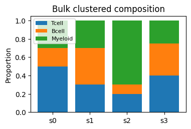
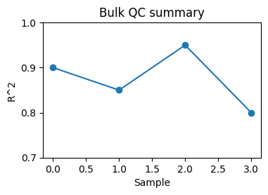
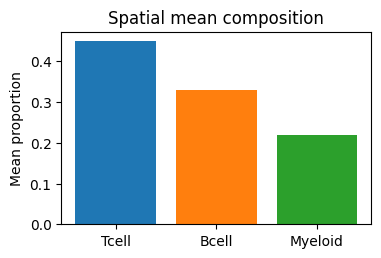
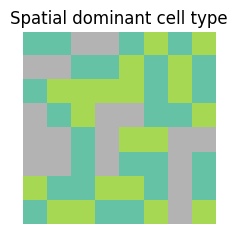
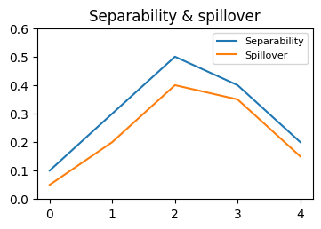

# TissueResolve Tutorial

## 1. Overview

TissueResolve is a unified deconvolution toolkit for:

- bulk RNA-seq deconvolution using protocol-aware weighted NNLS,
- 10x Visium spatial deconvolution using a negative-binomial CAR model.

It uses a shared single-cell reference abstraction, reports QC and warnings,
provides separability and spillover diagnostics, and exports publication-ready
reports and figures.

## 2. Installation

```bash
git clone https://github.com/marianaboroni/TissueResolve.git
dcd TissueResolve
python3 -m venv .venv
source .venv/bin/activate
python -m pip install -U pip
python -m pip install -e ".[all]"
```

Run the test suite:

```bash
python -m pytest -q
```

## 3. Input formats

### Single-cell reference

TissueResolve accepts a single-cell or single-nucleus reference as a `.h5ad`
file. The file should contain:

- `obs` with a cell-type label column such as `cell_type`
- `var` with gene names or identifiers
- raw counts or normalized expression values

The package also accepts a saved `ReferenceSignature` directory.

### Bulk counts table

A bulk query can be a tab-delimited counts table with genes in rows and
samples in columns. The first column is used as gene names.

### Visium input

Spatial data can be passed as either:

- a Visium `.h5ad` file containing spatial coordinates, image paths, and
  count data, or
- a Space Ranger-style output folder containing `filtered_feature_bc_matrix`
  and a `spatial/` directory.

## 4. Running a quick test

A fast smoke test uses the top-level `run` command with toy inputs:

```bash
tissueresolve run --reference reference.h5ad --query bulk_counts.tsv \
  --out results/bulk --mode bulk --preset quick
```

A spatial quick test is similar:

```bash
tissueresolve run --reference reference.h5ad --query visium.h5ad \
  --out results/spatial --mode spatial --preset standard
```

## 5. Building a reference

TissueResolve builds a reference from a single-cell `.h5ad` automatically
when passed with `--reference`. If you already have a saved reference
directory, pass that path instead.

There is no separate CLI command for reference construction in this version.
Use the `.h5ad` reference directly or build it in Python with the API.

## 6. Bulk analysis step-by-step

1. Prepare a single-cell reference `.h5ad` with a valid cell-type column.
2. Prepare a bulk counts table with genes as row names.
3. Run the top-level command:

```bash
tissueresolve run --reference reference.h5ad --query bulk_counts.tsv \
  --out results/bulk --mode bulk --preset standard
```

4. Generate an HTML report:

```bash
tissueresolve report --modality bulk --results-dir results/bulk
```

### What this produces

The `run` step writes the analysis bundle:

- `results/bulk/analysis_plan.json`
- `results/bulk/run_metadata.json`
- `results/bulk/deconv/` — `proportions.tsv` (predictions), gene panel, reconstruction QC
- `results/bulk/qc/` — QC metrics, recommendations
- `results/bulk/methods.txt` — auto-generated methods text
- `results/bulk/warnings.json` — surfaced warnings
- `results/bulk/report.html` — report generated from the run result

`run` renders `report.html` from the in-memory result; standalone figure files
(`figures/*.html` + `.data.tsv`) are produced by the report layer / validation
harness. You can also (re)generate a report from a results directory with the
`tissueresolve report` step (next).

## 7. Spatial analysis step-by-step

1. Prepare the same single-cell reference.
2. Provide a Visium input file or folder.
3. Run spatial deconvolution:

```bash
tissueresolve run --reference reference.h5ad --query visium.h5ad \
  --out results/spatial --mode spatial --preset publication
```

Alternatively:

```bash
tissueresolve spatial run --visium visium.h5ad \
  --reference reference.h5ad --output results/spatial
```

4. Generate a report:

```bash
tissueresolve report --modality spatial --results-dir results/spatial
```

## 7b. Analysing both bulk and spatial (separate runs, one reference)

A single `tissueresolve run` processes **one** modality. To analyse bulk and
spatial with the same reference, run them into **separate output directories**:

```bash
tissueresolve run --reference ref.h5ad --query bulk.tsv \
  --out results/bulk --mode bulk
tissueresolve run --reference ref.h5ad --query visium.h5ad \
  --out results/spatial --mode spatial
```

Do **not** write both to the same `--out` — the second run would overwrite the
first, so a cross-modality write into a non-empty run directory is **refused**
unless you pass `--force` (an intentional overwrite). Same-modality re-runs into
the same directory are allowed (they refresh it).

Merge the two runs into a single report (no re-running of deconvolution):

```bash
tissueresolve combine-report \
  --bulk-dir results/bulk --spatial-dir results/spatial \
  --out results/combined
```

This writes `results/combined/report.html` (+ `methods.txt`, `warnings.json`,
`run_metadata.json`), keeps bulk and spatial sections (and benchmark summaries)
separate, and states that it summarises two separate runs sharing a reference —
not a single joint bulk+spatial model.

## 8. Generating HTML reports

The root report command reads a results directory and writes a self-contained
HTML report.

```bash
tissueresolve report --modality bulk --results-dir results/bulk
```

The report includes:

- executive summary
- main publication figure
- interpretation text
- QC and warnings
- collapsible detailed outputs

## 9. Understanding output folders

A `tissueresolve run` writes:

- `analysis_plan.json` — the planned modality, preset, and resolution mode
- `run_metadata.json` — resolved parameters and provenance
- `deconv/` — `proportions.tsv` predictions, gene panel, reconstruction QC
- `qc/` — QC metrics, recommendations, Moran's I (spatial)
- `methods.txt` — auto-generated methods text
- `warnings.json` — surfaced warnings
- `report.html` — report generated from the run result

The report layer / validation harness additionally produce `tables/` and
`figures/` (each with a `.data.tsv`). `report.html` can also be (re)generated
from a results directory with `tissueresolve report` (above).

## 10. Understanding figures

Figures may include:

- Bulk clustered composition barplots
- Bulk QC summary plots
- Spatial mean composition barplots
- Spatial dominant cell-type maps
- Separability and spillover summaries







## 11. Understanding QC metrics

TissueResolve reports:

- reconstruction quality for bulk samples
- gene overlap between query and reference
- protocol compatibility risk
- spatial Moran's I and neighborhood statistics

Low overlap, poor separability, or non-convergence are surfaced as warnings.

## 12. Understanding separability and spillover

- Separability evaluates whether two cell types can be distinguished reliably.
- Spillover quantifies confusion between cell types from expression similarity.
- If cell types are confusable, the system produces family-level recommendations
  instead of silently merging or hiding uncertainty.

## 13. Tuning parameters

### General settings

- `--preset` — controls defaults for plotting, bootstrap, and tuning.
- `--dry-run` — write the analysis plan without running pipelines.

### Spatial settings

- `--config` — path to a YAML configuration file.
- `--cell-type-col` — reference cell-type column name (default `cell_type`).
- `--marker-genes` — optional marker gene list.
- `--lambda-spatial` — override CAR smoothing strength.
- `--max-iter` — override solver iterations.
- `--random-state` — RNG seed.
- `--min-counts` — minimum UMI per spot.
- `--min-genes` — minimum genes detected per spot.
- `--neighbourhood / --no-neighbourhood` — compute spot co-occurrence stats.
- `--genome` — reference genome assembly (`hg38` or `mm10`).

## 14. Common problems and solutions

- `low gene overlap` — check gene identifiers in bulk/spatial and reference.
- `missing cell-type column` — set `--cell-type-col` or rename the obs column.
- `non-converged spatial solver` — inspect `run_metadata.json` and try
  `--lambda-spatial` or `--max-iter`.
- `bootstrap not computed` — enable bootstrap in the preset or configuration.

## 15. Example: real breast cancer validation

Run the example scripts under `examples/real_breast_cancer/scripts/`:

```bash
python examples/real_breast_cancer/scripts/00_download_data.py
python examples/real_breast_cancer/scripts/01_prepare_reference.py
python examples/real_breast_cancer/scripts/02_make_pseudobulk.py
python examples/real_breast_cancer/scripts/03_run_bulk_validation.py
python examples/real_breast_cancer/scripts/04_run_spatial_validation.py
python examples/real_breast_cancer/scripts/05_summarize_results.py
python examples/real_breast_cancer/scripts/09_run_hierarchical_deconvolution.py
python examples/real_breast_cancer/scripts/07_generate_reports.py
```

This harness is designed to keep real-data validation separate from the default
package workflows.

## 16. Hierarchical (broad → fine) deconvolution

When a reference has many similar fine subtypes (T/NK subsets, macrophage /
monocyte / DC states, endothelial or epithelial subtypes, pericyte / smooth
muscle), estimating all of them at once produces many non-separable pairs and
spillover.  **Hierarchical mode** is a more cautious, BayesPrism-style strategy:

1. estimate **broad cell-type families** first,
2. estimate **fine subpopulations within each family**,
3. combine: `fine(subtype) = family(broad) × P(subtype | family)`,
4. report **unresolved family mass** when a family's subtypes are not separable.

Fine subtype estimates are only trusted when the model has evidence that the
subtype is distinguishable within its family (sufficient within-family
separability, enough discriminating genes, and low within-family spillover).
Otherwise the family's mass stays at the broad level as `unresolved_<family>`.

### Required reference annotations for hierarchical mode

For hierarchical deconvolution, your `.h5ad` reference should contain two
annotation columns in `adata.obs`:

| Column | Meaning | Example |
|---|---|---|
| `broad_cell_type` | major compartment / broad lineage | `T/NK`, `Myeloid`, `Epithelial` |
| `sub_cell_type` | fine cell type or cell state | `CD8 T cell`, `macrophage`, `luminal epithelial cell` |

Inspect your columns first:

```python
import anndata as ad
adata = ad.read_h5ad("reference.h5ad")
print(adata.obs.columns.tolist())
print(adata.obs[["broad_cell_type", "sub_cell_type"]].drop_duplicates())
```

If your reference contains **only** fine labels, provide a mapping file instead:

```text
fine_cell_type    broad_cell_type
CD4 T cell        T/NK
CD8 T cell        T/NK
macrophage        Myeloid
monocyte          Myeloid
luminal epithelial cell    Epithelial
```

Hierarchical mode never silently infers a hierarchy: if broad/fine columns are
missing or ambiguous and no mapping file is given, it fails with a clear error
asking you to set `--broad-cell-type-col` / `--fine-cell-type-col` or provide
`--cell-type-hierarchy mapping.tsv`.

### Flat vs hierarchical

- **Flat** (`--resolution-mode none`): estimate all fine cell types at once.
  Best when the fine types are well separated.
- **Hierarchical** (`--resolution-mode hierarchical`): broad-to-fine with
  unresolved-mass abstention.  Best when many fine types are similar — it
  reduces spillover between unrelated compartments and avoids overclaiming
  subtype fractions.

### Example commands

Bulk, flat (fine-only — request it explicitly):

```bash
tissueresolve run --mode bulk \
  --reference reference.h5ad --query bulk_counts.tsv \
  --resolution-mode flat \
  --out results/bulk_flat
```

> `tissueresolve bulk run` is an unimplemented stub; use `tissueresolve run
> --mode bulk` for bulk deconvolution.

Bulk, hierarchical:

```bash
tissueresolve run --mode bulk \
  --reference reference.h5ad --query bulk_counts.tsv \
  --broad-cell-type-col broad_cell_type --fine-cell-type-col sub_cell_type \
  --resolution-mode hierarchical --preset publication \
  --out results/bulk_hierarchical
```

Spatial, hierarchical:

```bash
tissueresolve run --mode spatial \
  --reference reference.h5ad --query visium.h5ad \
  --broad-cell-type-col broad_cell_type --fine-cell-type-col sub_cell_type \
  --resolution-mode hierarchical --preset publication \
  --out results/spatial_hierarchical
```

### Interpreting the outputs

- `*_family_proportions.tsv` — broad family composition (rows sum to 1).
- `*_conditional_fine_proportions.tsv` — `P(subtype | family)` (sums to 1 per
  family).
- `*_hierarchical_fine_proportions.tsv` — resolved subtypes (unresolved
  families are 0 here).
- `*_unresolved_family_mass.tsv` — mass kept at the family level.
- `*_hierarchical_qc.tsv` — per-family resolvability and the decision.

Read a **resolved** subtype as a subtype-level estimate, and an
`unresolved_<family>` column as a family-level estimate only — its subtypes
could not be separated in your data and should not be reported as confident
fractions.

Colours are consistent across all figures of a run: each broad family gets a
distinct base colour and its fine subtypes use related shades.  The mapping is
saved to `cell_type_color_map.tsv` (and `color_map.json`) so figures are
reproducible and customisable later.
